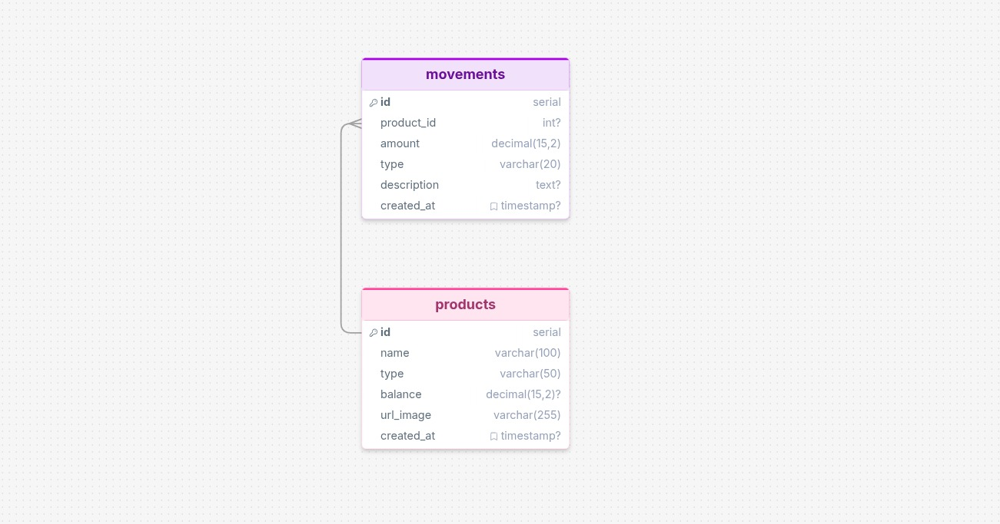

# TamalStore — Documentación

## Navegación

La aplicación es una **Single Page Application (SPA)** sin router. La navegación se maneja mediante renderizado condicional con SolidJS.

### Flujo de pantallas

```
[Login] ──login exitoso──> [Dashboard]
                                ├── AccountCard (saldo + tamalbits)
                                ├── ProductsList (productos + comprar)
                                └── ExpensesList (gastos recientes)
                           ──cerrar sesión──> [Login]
```

- **Login**: El usuario ingresa su `personId`. Se valida contra la API externa del banco. Si existe, pasa al dashboard.
- **Dashboard**: Muestra el saldo disponible, los tamalbits acumulados, el catálogo de productos y el historial de gastos.
- **Compra**: Al hacer clic en "Comprar" en un producto, se registra el gasto y automáticamente se refrescan el saldo, tamalbits y gastos recientes.

### API endpoints

| Método | Endpoint | Auth | Descripción |
|--------|----------|------|-------------|
| GET | `/api/status` | No | Health check |
| POST | `/api/auth/login` | No | Validar usuario |
| GET | `/api/products` | No | Listar productos |
| GET | `/api/products/{id}` | No | Producto específico |
| GET | `/api/account/{personId}` | Sí | Obtener saldo |
| POST | `/api/account/{personId}/deduct` | Sí | Descontar saldo |
| GET | `/api/expenses/{personId}` | Sí | Historial de gastos |
| POST | `/api/expenses/{personId}` | Sí | Registrar gasto |
| GET | `/api/tamalbits/{personId}` | Sí | Total tamalbits |

---

## Tecnología por utilizar

### Backend

| Tecnología | Versión | Propósito |
|------------|---------|-----------|
| **PHP** | 8.2 | Lenguaje principal del API |
| **PostgreSQL** | 15 | Base de datos relacional |
| **Nginx** | latest | Servidor web / proxy reverso |
| **Docker** | - | Contenedores y orquestación |
| **PDO** | - | Conexión a PostgreSQL |
| **cURL** | - | Comunicación con API externa del banco |

No se utiliza ningún framework ni Composer. El autoloader es manual mediante un mapa de clases en `bootstrap.php`.

### Frontend

| Tecnología | Versión | Propósito |
|------------|---------|-----------|
| **SolidJS** | 1.9.5 | Framework reactivo UI |
| **TypeScript** | 5.7 | Tipado estático |
| **Vite** | 7.1 | Bundler y dev server |
| **Font Awesome** | 7.2 | Iconos |

### Infraestructura

| Servicio | Puerto | Descripción |
|----------|--------|-------------|
| Frontend (Vite) | 3000 | Dev server con proxy a `/api` → `:8084` |
| Backend (Nginx) | 8084 | Sirve API PHP |
| PostgreSQL | 5433 | Base de datos (expuesto en host) |
| API Externa (Banco) | 8083 | Simulación de banco externo |

---

## Experiencia de usuario

### Login

1. El usuario ingresa su `personId` en un formulario.
2. Se envía `POST /api/auth/login` con `{ person_id }`.
3. El backend valida contra la API externa del banco.
4. Si el usuario existe → pasa al dashboard.
5. Si no existe → mensaje de error.

### Dashboard

Una vez autenticado, el usuario ve tres secciones:

**Cuenta** — Muestra el saldo disponible (consultado en tiempo real desde la API externa) y los tamalbits acumulados.

**Productos** — Catálogo de productos disponibles para comprar. Se puede filtrar por categoría (alimentación, servicios, transporte, otros). Cada producto muestra su precio y si otorga tamalbits.

**Gastos Recientes** — Historial de los últimos 10 gastos registrados.

### Compra de producto

1. El usuario hace clic en "Comprar" en un producto.
2. Se envía `POST /api/expenses/{personId}` con `{ product_id, type, description }`.
3. El backend:
   - Verifica saldo suficiente en la API externa.
   - Inicia una transacción en DB.
   - Descuenta el monto de la API externa del banco.
   - Registra el movimiento en la base de datos local.
   - Confirma la transacción (o revierte si algo falla).
   - Calcula tamalbits ganados (1 tamalbit por cada $10 en productos elegibles).
4. La UI se refresca automáticamente mostrando el nuevo saldo, tamalbits y gastos.

### Cierre de sesión

- Botón "Salir" en la esquina superior derecha.
- Vuelve a la pantalla de login.

---

## Modelo Entidad-Relación



### Tabla: `products`

| Columna | Tipo | Descripción |
|---------|------|-------------|
| id | SERIAL PK | Identificador único |
| name | VARCHAR(100) | Nombre del producto |
| type | VARCHAR(50) | Categoría: alimentacion, servicios, transporte, otros |
| balance | DECIMAL(15,2) | Precio del producto |
| gives_tamalbits | BOOLEAN | Indica si otorga tamalbits |
| created_at | TIMESTAMP | Fecha de creación |

### Tabla: `movements`

| Columna | Tipo | Descripción |
|---------|------|-------------|
| id | SERIAL PK | Identificador único |
| product_id | INTEGER FK → products(id) | Producto comprado |
| person_id | VARCHAR(50) | Identificador del usuario |
| amount | DECIMAL(15,2) | Monto (negativo para gastos) |
| type | VARCHAR(20) | Categoría del gasto |
| description | TEXT | Descripción |
| api_transaction_id | VARCHAR(100) | ID de transacción del banco externo |
| api_deducted | BOOLEAN | Indica si se descontó del banco |
| created_at | TIMESTAMP | Fecha del movimiento |

### Relaciones

- `movements.product_id` → `products.id` (relación muchos a uno).
- Un producto puede tener muchos movimientos.
- Un movimiento pertenece a un solo producto.

### Reglas de negocio

- **Tamalbits**: Se calculan como `SUM(ABS(amount) / 10)` solo para movimientos de productos con `gives_tamalbits = true`.
- **Consistencia**: Cada gasto primero descuenta de la API externa del banco y solo si eso funciona, registra el movimiento local. Todo dentro de una transacción de base de datos.
